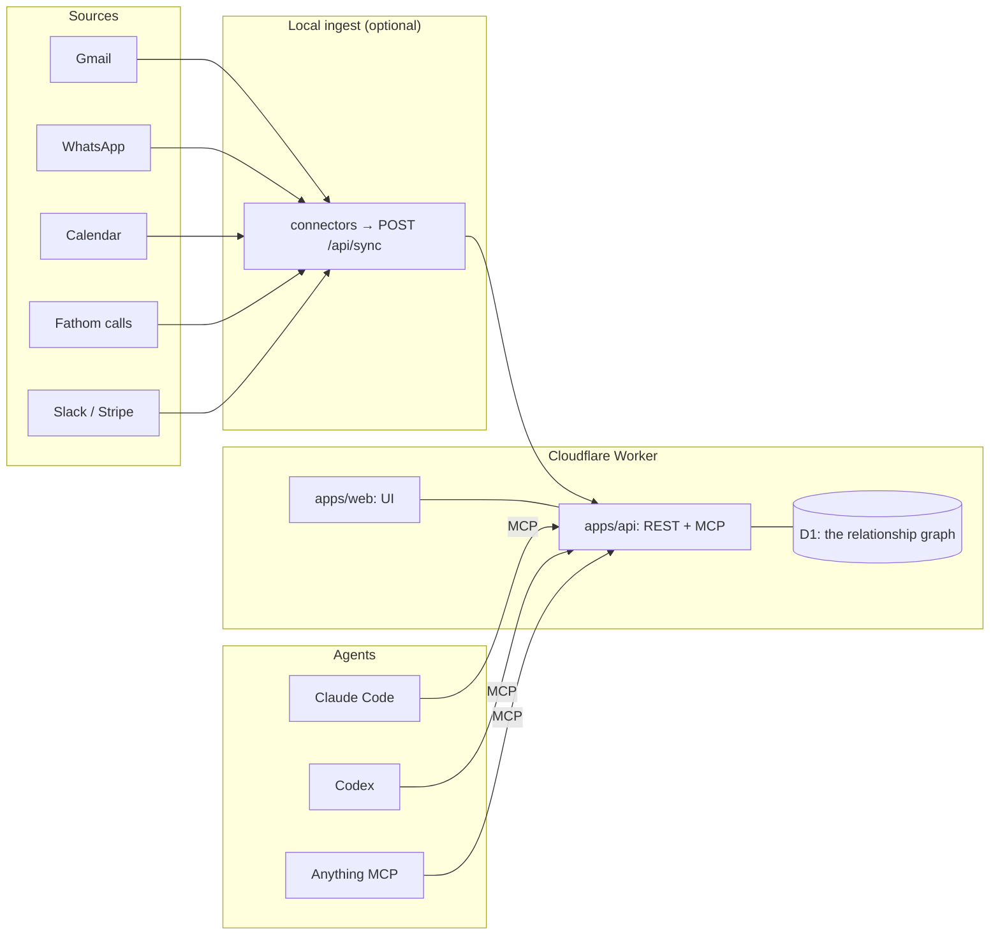

# relationship-manager

**One graph of the people you actually talk to — and an agent API on top of it.**

[](./LICENSE)
[](./AGENTS.md)
[](./wrangler.jsonc)

Your relationships are spread across Gmail, WhatsApp, your calendar and recorded calls. Every
tool that tries to "manage" them wants you to type data in — the one thing you will never do.

`relationship-manager` reads the graph you already produced: it resolves the same human across
email, phone, WhatsApp JID and meeting attendee, keeps what it learns as **evidence-backed
facts**, and exposes the whole thing to **agents first** — one remote MCP endpoint, a REST API
and a CLI generated from a single tool contract.

Humans get a calm surface for the two jobs that actually need a human: *deciding what's true*
and *deciding who to reach out to*.

---

## What it does

- **Resolves identity across sources.** `person_identifiers` is the authoritative index — email,
  phone, WhatsApp JID, meeting-attendee name. One human, one row, no duplicates invented.
- **Keeps evidence, not vibes.** Every fact carries the observations that produced it and a band
  scored in code: `VERIFIED` (may be written), `PROBABLE` / `POSSIBLE` (offered for your call),
  below that (not stored at all). The model never supplies a confidence number.
- **Prepares you.** `prep_brief` is deterministic and free — who they are, how you're reachable,
  what's on file, recent email, meetings, WhatsApp, calls.
- **Knows who to reconnect with.** Cohort-ranked, suppression-respecting, with the history it
  was derived from.
- **Never sends anything.** Agents can propose outreach; a human approves it. Writes are a
  different class of thing.

## Architecture



One definition drives all three surfaces: `packages/core/src/tools.ts`. The MCP server, the REST
router and the CLI register from that list, so the tool you read about is the tool an agent calls.

## Monorepo layout

```
apps/api            Cloudflare Worker — REST + remote MCP + auth + D1
apps/web            Vite + React UI (AIOS design tokens, light/dark)
packages/core       evidence ledger, identity resolution, the tool contract (+ tests)
packages/seed       importers: real corpora + live SQLite → migrations/seed.sql
packages/cli        `rel` — talk to the deployed graph from a terminal; stdio MCP bridge
skill/              the agent skill bundle (teaches an agent how to use the tools well)
connectors/         (phase 2) local Python ingest → POST /api/sync
```

## Tools (the agent surface)

| Tool | Scope | What it does |
|---|---|---|
| `search_people` | read | Find people by name, email, company or domain |
| `get_person` | read | Full record: identity, evidence-backed facts, identifiers, counts |
| `prep_brief` | read | Deterministic markdown brief before you talk to someone |
| `person_timeline` | read | Merged chronology: email, meetings, WhatsApp, calls |
| `list_facts` | read | Facts that are settled and facts awaiting a human decision |
| `reconnect_queue` | read | Ranked reconnect list with cohort, signal and draft |
| `connection_status` | read | Honest per-source freshness — connected, stale, error |
| `record_fact` | write | The only path for agent-derived facts; evidence bands decide what happens |
| `decide_fact` | write | Accept or dismiss a proposed fact (accept freezes the field as human-held) |
| `log_outreach` | write | Record an outreach attempt and a follow-up date |
| `propose_outreach` | write | Queue a draft for human approval — agents cannot send |

## Quick start

```bash
npm install
cp .dev.vars.example .dev.vars     # LOGIN_PASSWORD, SESSION_SECRET

# build + seed + deploy
npm run build
npm run seed:build                 # reads reference/ → packages/seed/out/seed.sql
npx wrangler d1 create relationship-manager   # paste database_id into wrangler.jsonc
npm run db:migrate && npm run seed:push
npx wrangler secret put LOGIN_PASSWORD
npx wrangler secret put SESSION_SECRET
npm run deploy
```

Local development (UI against the real API):

```bash
npm run dev                        # Vite dev server, proxies /api → wrangler dev
npx wrangler dev                   # the API on :8787
```

## Connect an agent

```bash
# Claude Code
claude mcp add --transport http relationship-manager https://<your-worker>/mcp \
  --header "Authorization: Bearer rel_..."

# Codex (~/.codex/config.toml)
[mcp_servers.relationship-manager]
url = "https://<your-worker>/mcp"
http_headers = { Authorization = "Bearer rel_..." }
```

Then ask: *"who should I reconnect with this week, and why?"* — the agent calls
`reconnect_queue` and `prep_brief`, and every call shows up in the **Agents** screen.

## Safety

- Reads by default. Writes are opt-in per agent key (`scopes: read|write`), validated server-side
  in one place, and logged.
- Facts need evidence. `score_evidence()` decides the band; below `POSSIBLE` nothing is stored.
- No sending. Agents can draft and propose; a human approves. Outreach is logged, never fired.
- **Your data never enters this repo.** The graph lives in your own Cloudflare D1 database and in
  local files (`reference/`, the generated `packages/seed/out/`) — all gitignored. The repository
  is the engine, the surfaces and the deploy path, and nothing else. Run it in your own account,
  behind a password.

## License

MIT — see [LICENSE](./LICENSE).

## Part of the everyai-com agent stack

- [distillory](https://github.com/everyai-com/distillory) — local-first memory engine that reasons at ingestion
- [agent-ready](https://github.com/everyai-com/agent-ready) — turn any backend into an MCP server, API and CLI
- [agentprofile](https://github.com/everyai-com/agentprofile) — one agent identity across every tool
- [primer](https://github.com/everyai-com/primer) — live business context injected into any agent
- [plainsync](https://github.com/everyai-com/plainsync) — local-first Markdown workspace for humans + agents
- [argus](https://github.com/everyai-com/argus) — cloud-native software verification

Built by [Phanindra Reddy](https://github.com/everyai-com) · [magicteams.ai](https://magicteams.ai)

## License

Apache-2.0 — see [LICENSE](./LICENSE).
