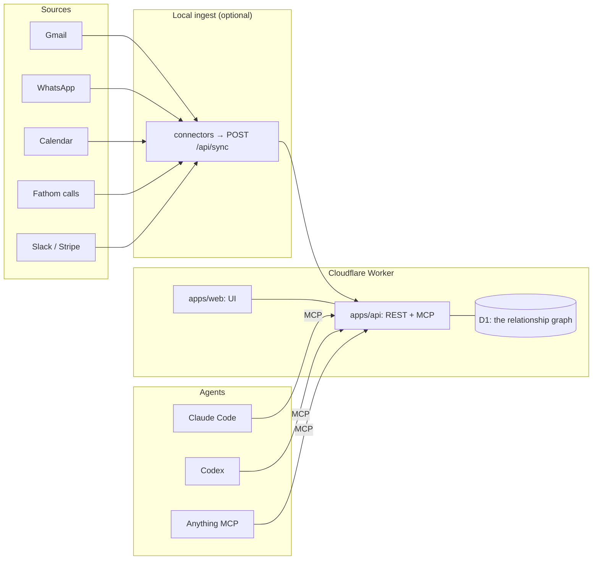

# relationship-manager

**One graph of the people you actually talk to — and an agent API on top of it.**

[](./LICENSE)
[](./AGENTS.md)
[](./wrangler.jsonc)

Your relationships are spread across Gmail, WhatsApp, your calendar and recorded calls. Every
tool that tries to "manage" them wants you to type data in — the one thing you will never do.

`relationship-manager` reads the graph you already produced: it resolves the same human across
email, phone, WhatsApp JID and meeting attendee, keeps what it learns as **evidence-backed
facts**, and exposes the whole thing to **agents first** — one remote MCP endpoint, a REST API
and a CLI generated from a single tool contract.

Humans get a calm surface for the two jobs that actually need a human: *deciding what's true*
and *deciding who to reach out to*.

---

## The surfaces

- **Today** — what needs you now: facts awaiting a decision, follow-ups that have come due, sources
  that have gone quiet, and what agents did in the last day.
- **People** — search, filter by source or pipeline stage, and **expand a profile in place** to see
  what is known, what needs your call, and the last few things that happened. `⌘K` searches from
  anywhere.
- **Pipeline** — a **kanban board** of where each relationship stands. Drag a card to move someone;
  the move is optimistic and rolls back with a message if the write is refused.
- **Profile drawer** — clicking through opens the full record beside the list rather than replacing
  it: overview, history, and the deterministic brief, with the stage selector and the evidence
  behind every value.
- **Reconnect** — the ranked queue with the signal that put each person there; suppressed holds stay
  out unless you ask.
- **Connections** — where the graph came from and how fresh it is. Freshness is
  computed from the newest row in the graph, so a source that stopped producing reads
  as *stale* with the date — a connector cannot claim otherwise.
- **Agents** — the MCP endpoint, keys, the tool catalogue, the call log and the kill switch.

## Keeping it fresh

The hosted app is a snapshot until something feeds it; `connectors/` is that something.

```bash
cd connectors && cp .env.example .env     # REL_API, REL_KEY, and any source keys
python3 -m rel_sync.cli status            # what is connected, and what is missing
python3 -m rel_sync.cli all               # push everything reachable
```

- **aios** — reads the AIOS desktop app's own database on this machine (mail, calendar,
  WhatsApp). Works with no new credentials.
- **fathom / gmail / calendar** — live through Composio, or Fathom directly with an API key.
- Pushes are idempotent: only genuinely new messages move counts and last-touch, so
  re-running an unchanged mailbox changes nothing.
- Standard library only — no `pip install`, nothing to rot. See `connectors/README.md`.

## What it does

- **Resolves identity across sources.** `person_identifiers` is the authoritative index — email,
  phone, WhatsApp JID, LinkedIn profile, Instagram handle, meeting-attendee name. One human, one
  row, no duplicates invented.
- **Keeps evidence, not vibes.** Every fact carries the observations that produced it and a band
  scored in code: `VERIFIED` (may be written), `PROBABLE` / `POSSIBLE` (offered for your call),
  below that (not stored at all). The model never supplies a confidence number.
- **Prepares you.** `prep_brief` is deterministic and free — who they are, how you're reachable,
  what's on file, recent email, meetings, WhatsApp, recorded calls, LinkedIn.
- **Knows who to reconnect with.** Cohort-ranked, suppression-respecting, with the history it
  was derived from.
- **Answers from the record, not the internet.** `ask_about_person` and `daily_brief` run on
  Workers AI (`@cf/zai-org/glm-5.3-flash`) with the graph as the only context — and say what is
  missing instead of inventing it.
- **Never sends anything.** Agents can propose outreach; a human approves it. Writes are a
  different class of thing.

## Social sources (LinkedIn, Instagram)

LinkedIn has no API for a personal account's own connections, and Instagram's Graph API is
business-only. Scraping either one breaks their terms and risks the account — so this system
takes the only legitimate path: **your official export.**

```bash
# LinkedIn → Settings → Data privacy → Get a copy of your data → Connections
rel import-linkedin ~/Downloads/Basic_LinkedInDataExport_2026-05-18     # Connections + Invitations
rel import-linkedin ~/Downloads/Basic_LinkedInDataExport_2026-05-18 --limit 10000   # + recent DMs

# Instagram → Accounts Center → Download your information → Followers and following (JSON)
rel import-instagram ~/Downloads/instagram-yourname-2026-09-14.zip
```

- A handle **merges into the existing person** — the same human never forks into two rows, and
  your invitations bring the message you actually wrote.
- A **connection or a DM** is a primary observation (`linkedin.connection` 0.8,
  `linkedin.message-exchanged` 0.85). A **follow** is not (`instagram.you-follow` 0.5), so follows
  arrive as suggestions rather than assertions.
- The Connections screen reports these honestly: imported, never "live" — refreshing means
  exporting again.

Built by [Phanindra Reddy](https://github.com/everyai-com) at **Saphaare Labs** · [magicteams.ai](https://magicteams.ai)

## Architecture



One definition drives all three surfaces: `packages/core/src/tools.ts`. The MCP server, the REST
router and the CLI register from that list, so the tool you read about is the tool an agent calls.

## Monorepo layout

```
apps/api            Cloudflare Worker — REST + remote MCP + auth + D1
apps/web            Vite + React UI (AIOS design tokens, light/dark)
packages/core       evidence ledger, identity resolution, the tool contract (+ tests)
packages/seed       importers: real corpora + live SQLite → migrations/seed.sql
packages/cli        `rel` — talk to the deployed graph from a terminal; stdio MCP bridge
skill/              the agent skill bundle (teaches an agent how to use the tools well)
connectors/         (phase 2) local Python ingest → POST /api/sync
```

## Tools (the agent surface)

| Tool | Scope | What it does |
|---|---|---|
| `search_people` | read | Find people by name, email, company or domain |
| `get_person` | read | Full record: identity, evidence-backed facts, identifiers, counts |
| `prep_brief` | read | Deterministic markdown brief before you talk to someone |
| `person_timeline` | read | Merged chronology: email, meetings, WhatsApp, calls |
| `list_facts` | read | Facts that are settled and facts awaiting a human decision |
| `reconnect_queue` | read | Ranked reconnect list with cohort, signal and draft |
| `connection_status` | read | Honest per-source freshness — connected, stale, error |
| `record_fact` | write | The only path for agent-derived facts; evidence bands decide what happens |
| `decide_fact` | write | Accept or dismiss a proposed fact (accept freezes the field as human-held) |
| `log_outreach` | write | Record an outreach attempt and a follow-up date |
| `propose_outreach` | write | Queue a draft for human approval — agents cannot send |

## Quick start

```bash
npm install
cp .dev.vars.example .dev.vars     # BETTER_AUTH_SECRET, BETTER_AUTH_URL

# build + seed + deploy
npm run build
npm run seed:build                 # reads reference/ → packages/seed/out/seed.sql
npx wrangler d1 create relationship-manager   # paste database_id into wrangler.jsonc
npm run db:migrate                 # schema + socials + auth tables
npm run seed:push
npx wrangler secret put BETTER_AUTH_SECRET     # openssl rand -hex 32
npx wrangler secret put BETTER_AUTH_URL        # your worker URL
npm run deploy
```

Then open the app and create the first account — it becomes the owner. After that, sign-up is
closed unless you set `ALLOWED_EMAILS` (a comma-separated list) as a var:

```bash
# optional: let a teammate in
npx wrangler secret put ALLOWED_EMAILS   # "you@example.com, them@example.com"
```

Local development (UI against the real API):

```bash
npm run dev                        # Vite dev server, proxies /api → wrangler dev
npx wrangler dev --port 8799       # the API (pick a free port; 8787 is popular)
```

## Accounts

[Better Auth](https://better-auth.com) on Cloudflare: email + password, sessions in D1, HttpOnly
cookies, no third party in the loop.

- **The first account becomes the owner.** Sign-up then closes — this graph is someone's private
  relationships, and an open sign-up form is a data leak with a nice UI. Add `ALLOWED_EMAILS`
  (comma-separated) to let specific other people in.
- **Humans and agents are different principals.** A human session can do everything; an agent key
  carries explicit scopes, is revocable, and every call is logged. Agents never touch the session
  table.
- Sessions last 30 days and refresh daily. Signing out invalidates the session server-side, and
  the test suite proves it.

## Testing

Two suites, both runnable:

```bash
npm test                                  # unit: the evidence ledger and identity resolution
REL_API=… REL_KEY=… REL_PASSWORD=… npm run test:e2e
```

`tests/e2e.mjs` runs **against a real deployment** — no mocks. It covers auth and session
forgery, agent key scopes (a read key must be denied on every write tool *and* that denial must
reach the call log), the kill switch, the evidence law end to end (weak evidence stores nothing,
medium becomes a suggestion, strong is applied; a human decision freezes the field; a dismissed
value never returns), the reconnect queue's suppression rules, LinkedIn/Instagram imports
(including that a re-import merges rather than forks), the Workers AI tools (including that the
model says *"the record doesn't say"* instead of inventing), the MCP protocol (tools/list matches
the REST catalogue exactly), and the web shell.

It is written to be re-runnable: each run writes fresh fact values, so a second run tests the
behaviour rather than the first run's leftovers. It creates one clearly-labelled person
(`ZZ E2E Probe`) and prints the SQL to remove it.

## Connect an agent

```bash
# Claude Code
claude mcp add --transport http relationship-manager https://<your-worker>/mcp \
  --header "Authorization: Bearer rel_..."

# Codex (~/.codex/config.toml)
[mcp_servers.relationship-manager]
url = "https://<your-worker>/mcp"
http_headers = { Authorization = "Bearer rel_..." }
```

Then ask: *"who should I reconnect with this week, and why?"* — the agent calls
`reconnect_queue` and `prep_brief`, and every call shows up in the **Agents** screen.

## Safety

- **Accounts, not a shared password.** Better Auth sessions in D1; the first account is the owner
  and sign-up closes after that. The session cookie is HttpOnly and signing out kills it
  server-side.
- Reads by default. Writes are opt-in per agent key (`scopes: read|write`), validated server-side
  in one place, and logged.
- Facts need evidence. `score_evidence()` decides the band; below `POSSIBLE` nothing is stored.
- No sending. Agents can draft and propose; a human approves. Outreach is logged, never fired.
- **Your data never enters this repo.** The graph lives in your own Cloudflare D1 database and in
  local files (`reference/`, the generated `packages/seed/out/`) — all gitignored. The repository
  is the engine, the surfaces and the deploy path, and nothing else. Run it in your own account.

## License

MIT — see [LICENSE](./LICENSE).

## Part of the everyai-com agent stack

- [distillory](https://github.com/everyai-com/distillory) — local-first memory engine that reasons at ingestion
- [agent-ready](https://github.com/everyai-com/agent-ready) — turn any backend into an MCP server, API and CLI
- [agentprofile](https://github.com/everyai-com/agentprofile) — one agent identity across every tool
- [primer](https://github.com/everyai-com/primer) — live business context injected into any agent
- [plainsync](https://github.com/everyai-com/plainsync) — local-first Markdown workspace for humans + agents
- [argus](https://github.com/everyai-com/argus) — cloud-native software verification

Built by [Phanindra Reddy](https://github.com/everyai-com) at **Saphaare Labs** · [magicteams.ai](https://magicteams.ai)

## License

MIT — see [LICENSE](./LICENSE).
