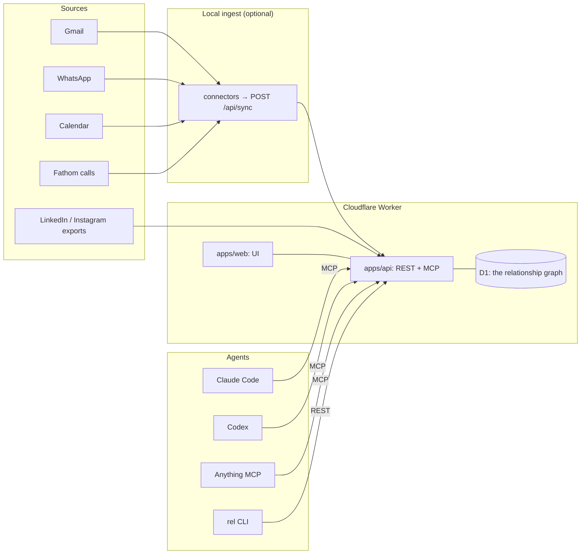

# relationship-manager

**One graph of the people you actually talk to — and an agent API on top of it.**

[](./LICENSE)
[](./AGENTS.md)
[](./packages/core/src/tools.ts)
[](./tests/e2e.mjs)
[](./wrangler.jsonc)

Your relationships are spread across Gmail, WhatsApp, your calendar and recorded calls. Every
tool that tries to "manage" them wants you to type data in — the one thing you will never do.

`relationship-manager` reads the graph you already produced: it resolves the same human across
email, phone, WhatsApp JID and meeting attendee, keeps what it learns as **evidence-backed
facts**, and exposes the whole thing to **agents first** — one remote MCP endpoint, a REST API
and a CLI generated from a single tool contract.

Humans get a calm surface for the two jobs that actually need a human: *deciding what's true*
and *deciding who to reach out to*.

## Demo

[](https://www.loom.com/share/2bcc0b3f99e24ecb91c35d4a5410aea7)

**Walkthrough (2:26, Loom):** [Sync Your Contacts and Conversation Pipelines](https://www.loom.com/share/2bcc0b3f99e24ecb91c35d4a5410aea7) — click the preview to play.

**Live app:** https://relationship-manager.everyai-com.workers.dev (sign-up is closed after the
owner account — the deployment is one person's real relationships, not a demo tenant).

The demo shows, in one take: sign in → **Ask** answers a question about the graph while
streaming, cites what it drew on and refuses what the record does not say → a profile pinned
into Ask → **Connections** showing which sources are fresh, which have stopped, and every push
that ever landed.

## Contents

- [What this is](#what-this-is)
- [Quick start (self-host)](#quick-start-self-host)
- [Connect an agent](#connect-an-agent)
- [MCP reference](#mcp-reference)
- [Tools (the agent surface)](#tools-the-agent-surface)
- [The CLI](#the-cli)
- [REST API](#rest-api)
- [Connectors: keeping it fresh](#connectors-keeping-it-fresh)
- [Operations](#operations)
- [Architecture](#architecture)
- [Repo layout](#repo-layout)
- [Safety and privacy](#safety-and-privacy)
- [License](#license)

## What this is

- **Resolves identity across sources.** `person_identifiers` is the authoritative index — email,
  phone, WhatsApp JID, LinkedIn profile, Instagram handle, meeting-attendee name. One human, one
  row, no duplicates invented.
- **Keeps evidence, not vibes.** Every fact carries the observations that produced it and a band
  scored in code: `VERIFIED` (may be written), `PROBABLE` / `POSSIBLE` (offered for your call),
  below that (not stored at all). The model never supplies a confidence number.
- **Prepares you.** `prep_brief` is deterministic and free — who they are, how you're reachable,
  what's on file, recent email, meetings, WhatsApp, recorded calls, LinkedIn.
- **Knows who to reconnect with.** Cohort-ranked, suppression-respecting, with the history it
  was derived from.
- **Answers from the record, not the internet.** `ask_about_person` and `daily_brief` run on
  Workers AI (`@cf/zai-org/glm-5.3-flash`) with the graph as the only context — and say what is
  missing instead of inventing it.
- **Never sends anything.** Agents can propose outreach; a human approves it. Writes are a
  different class of thing.

### The surfaces

- **Today** — what needs you now: facts awaiting a decision, follow-ups that have come due, sources
  that have gone quiet, and what agents did in the last day.
- **Ask** — a conversation with the graph. Answers **stream**, name the people and the trace they
  came from, and carry what they were grounded on (people / facts / sources). Threads are saved;
  open a profile and hit *Ask about them* to pin that person's record to the conversation. It reads
  and only reads — if the record is silent, the answer says so.
- **People** — search, filter by source or pipeline stage, and **expand a profile in place** to see
  what is known, what needs your call, and the last few things that happened. `⌘K` searches from
  anywhere.
- **Pipeline** — a **kanban board** of where each relationship stands. Drag a card to move someone;
  the move is optimistic and rolls back with a message if the write is refused.
- **Profile drawer** — clicking through opens the full record beside the list rather than replacing
  it: overview, history, and the deterministic brief, with the stage selector and the evidence
  behind every value.
- **Reconnect** — the ranked queue with the signal that put each person there; suppressed holds stay
  out unless you ask.
- **Connections** — where the graph came from and how fresh it is. Every source carries its real
  row counts, the age of its newest row, and the exact command that refreshes it; the push log
  underneath shows every write that ever landed. Freshness is computed from the newest row in the
  graph, so a source that stopped producing reads *stale* with the date — a connector cannot claim
  otherwise, and a count with no rows behind it says so.
- **Agents** — the MCP endpoint, keys, the tool catalogue, the call log and the kill switch.

## Quick start (self-host)

Runs entirely in your own Cloudflare account. One Worker, one D1 database, one AI binding —
there is no hosted service in the loop and no data leaves your account.

**Prerequisites**

| Requirement | Notes |
|---|---|
| Node | `>= 20` |
| Python | `>= 3.9` — only for the local connectors, standard library, nothing to `pip install` |
| Cloudflare | a free account with Workers, D1 and Workers AI enabled |
| Tools | `npm` (workspaces), `npx wrangler` (installed as a dev dependency) |

```bash
# 1. install
git clone https://github.com/everyai-com/relationship-manager.git
cd relationship-manager
npm install

# 2. local env — copy the template and fill it in
cp .dev.vars.example .dev.vars

# 3. your own database — paste the id it prints into wrangler.jsonc
npm run db:create

# 4. schema: identity, evidence, socials, auth, pipeline, chat
npm run db:migrate

# 5. optional — seed from your own corpora (see Operations below)
npm run seed:build && npm run seed:push

# 6. secrets, then deploy
npx wrangler secret put BETTER_AUTH_SECRET     # openssl rand -hex 32
npx wrangler secret put BETTER_AUTH_URL        # https://<your-worker>.workers.dev
npm run build && npm run deploy
```

Open the deployed app and create the first account — **it becomes the owner**. Sign-up closes
after that; set `ALLOWED_EMAILS` to let specific other people in.

```bash
# optional: let a teammate in
npx wrangler secret put ALLOWED_EMAILS   # "you@example.com, them@example.com"
```

Local development against the real API:

```bash
npx wrangler dev            # the Worker + D1, on http://127.0.0.1:8787
npm run dev                 # the UI on http://localhost:5173, proxies /api and /mcp to 8787
```

> If you change the Worker port, change `BETTER_AUTH_URL` in `.dev.vars` to match — Better Auth
> refuses a mismatched origin.

## Connect an agent

### 1. Mint a key

Open **Agents** in the app → *New key*. Pick `read` or `read,write`. The plaintext `rel_…` key is
shown **once** and stored only as a SHA-256 hash. Or do it over the API:

```bash
curl -X POST https://<your-worker>/api/agents \
  -H "Authorization: Bearer <human session or a write key>" \
  -H "Content-Type: application/json" \
  -d '{"name":"claude-code","scopes":"read,write"}'
```

### 2. Point your client at `/mcp`

**Claude Code**

```bash
claude mcp add --transport http relationship-manager https://<your-worker>/mcp \
  --header "Authorization: Bearer rel_..."
```

**Codex** — `~/.codex/config.toml`

```toml
[mcp_servers.relationship-manager]
url = "https://<your-worker>/mcp"
http_headers = { Authorization = "Bearer rel_..." }
```

**Cursor, or any JSON MCP config**

```json
{
  "mcpServers": {
    "relationship-manager": {
      "url": "https://<your-worker>/mcp",
      "headers": { "Authorization": "Bearer rel_..." }
    }
  }
}
```

**Clients that only speak stdio** (Claude Desktop, older Cursor) — use the local bridge in
`packages/cli/src/mcp-stdio.ts`, which proxies to the remote endpoint:

```json
{
  "mcpServers": {
    "relationship-manager": {
      "command": "npx",
      "args": ["tsx", "/absolute/path/to/packages/cli/src/mcp-stdio.ts"],
      "env": { "REL_API": "https://<your-worker>", "REL_KEY": "rel_..." }
    }
  }
}
```

**One command for all of the above** — [`skill/relationship-manager/scripts/rel-setup.sh`](./skill/relationship-manager/scripts/rel-setup.sh)
writes the Claude Code and Codex entries for you:

```bash
REL_API=https://<your-worker> REL_KEY=rel_... ./skill/relationship-manager/scripts/rel-setup.sh
```

### 3. Give the agent the skill

`skill/relationship-manager/` teaches an agent **how to use the tools well**, not just how to
call them: read `prep_brief` before recommending anything, prefer `person_timeline` over a
summary, be honest about staleness, respect holds, never scrape a social network, and never claim
something was sent. Drop the folder wherever your client discovers skills, or point the agent at
[`AGENTS.md`](./AGENTS.md) — the same contract in one file.

### 4. Ask it something

> *"Who should I reconnect with this week, and why?"*

The agent calls `reconnect_queue` and `prep_brief`, and every call lands in the **Agents** screen
with its arguments, result and whether it was allowed.

## MCP reference

| Property | Value |
|---|---|
| **Endpoint** | `https://<your-worker>/mcp` — one endpoint, no second server |
| **Transport** | Streamable HTTP, stateless (`sessionIdGenerator: undefined`, JSON responses) |
| **Auth** | `Authorization: Bearer rel_…` agent key — or a signed-in human's session cookie |
| **Scopes** | `read` or `read,write`, per key, enforced server-side |
| **Protocol** | `2025-06-18`; the e2e suite asserts `tools/list` matches the REST catalogue exactly |
| **Surfaces** | tools only — no MCP resources or prompts |
| **Implementation** | [`apps/api/src/mcp.ts`](./apps/api/src/mcp.ts), registered from [`packages/core/src/tools.ts`](./packages/core/src/tools.ts) |
| **stdio bridge** | `npm run rel:mcp` → [`packages/cli/src/mcp-stdio.ts`](./packages/cli/src/mcp-stdio.ts) |

Every request carries its own key, so there is no session state to leak between callers. The
server advertises the evidence law and the no-send rule in its `instructions`, so a client that
reads them starts with the rules.

## Tools (the agent surface)

Seventeen tools, **11 read / 6 write**, defined once in
[`packages/core/src/tools.ts`](./packages/core/src/tools.ts). The MCP server, the REST router and
the CLI all register from that list — the tool you read about is the tool an agent calls.
`GET /api/tools` returns the same catalogue as JSON.

### Read

| Tool | Arguments | What it does |
|---|---|---|
| `search_people` | `query?` `source?` `stage?` `limit?` | Find people by name, email, company, domain or handle. Start here when you don't have a person id. |
| `get_person` | `person_id` | The full record: identity, settled facts with their evidence and reasons, handles, counts. |
| `prep_brief` | `person_id` | Deterministic markdown brief to read before you talk to someone. No model spent. |
| `person_timeline` | `person_id` `limit?` | Merged chronology — email, meetings, calls, WhatsApp. Ground truth for "when did we last talk". |
| `list_facts` | `status?` `person_id?` `limit?` | `PROPOSED` is what awaits a human decision; `APPLIED` is settled. |
| `reconnect_queue` | `cohort?` `limit?` `include_suppressed?` | Ranked reconnect list with cohort, signal and a starter draft. Holds stay hidden unless asked for. |
| `connection_status` | — | Per-source freshness: status, last sync, row count. Call it before implying anything is current. |
| `pipeline_board` | `query?` `per_stage?` | People grouped by the stage you placed them in. Only placed people appear. |
| `ask_about_person` | `person_id` `question?` | Workers AI, grounded on that person's record only — if the record is silent it says so. |
| `daily_brief` | `focus?` | Workers AI brief from overdue follow-ups, undecided facts and the top of the queue. |
| `about` | — | Who built this, and honest live counts of what the graph holds. |

### Write

| Tool | Arguments | What it does |
|---|---|---|
| `record_fact` | `person_id` `field` `value` `evidence[]` `source_url?` | The only path for agent-derived facts. Evidence bands decide what happens. |
| `decide_fact` | `fact_id` `decision` (`accept`\|`dismiss`) | Accept writes the value and freezes the field as human-held; dismiss means it never returns. |
| `set_person_stage` | `person_id` `stage` | Move someone on the board (`""` removes them). Records position; sends nothing. |
| `log_outreach` | `person_id` `channel` `body` `subject?` `followup_at?` | Record an outreach that already happened, and when to review it again. |
| `propose_outreach` | `person_id` `channel` `body` `subject?` `rationale?` | Queue a draft for human approval. The end of an agent's reach. |
| `import_social_export` | `source` `people[]` `messages[]` `self_handles[]` | Official LinkedIn / Instagram exports. Handles merge into existing people; profile fields arrive as suggestions. |

### The evidence law

Facts are not written, they are **earned**. `record_fact` is the only write path, and it scores
the observations the agent supplies — **the model never supplies a confidence number.**

| Band | Score | What happens |
|---|---|---|
| `VERIFIED` | ≥ 0.85 **and** at least one primary observation | written to the record (`APPLIED`) |
| `PROBABLE` | ≥ 0.55 | stored as a suggestion (`PROPOSED`) — the human decides |
| `POSSIBLE` | ≥ 0.3 | stored as a suggestion (`PROPOSED`) |
| below | < 0.3 | **not stored at all** |

`agent.inference` (0.25) and `heuristic.estimate` (0.3) are deliberately weak, so an unsupported
guess cannot clear the bar. A `contradiction` observation caps the score at 0.45 and demotes the
claim to a suggestion. If a human has decided a field, no agent can overwrite it. Weights live in
[`packages/core/src/evidence.ts`](./packages/core/src/evidence.ts).

### Authority, the kill switch and the log

- **Reads are open.** Every key can read.
- **Writes are opt-in per key** and checked in one place — [`apps/api/src/tools/dispatch.ts`](./apps/api/src/tools/dispatch.ts) —
  before anything runs. A read-only key calling a write tool gets `403 denied`, and the denial is
  logged like any other call.
- **The kill switch.** Pausing agents in the UI (`POST /api/agents/0/pause`) rejects every agent
  write immediately, without touching keys.
- **Nothing is sent.** There is no send tool. `propose_outreach` writes a row to `approvals`,
  where a human approves or denies it.
- **Every call is logged** — tool, arguments hash, scope decision, outcome — and shown in the
  Agents screen.

## The CLI

`rel` talks to the same deployment through the same tool contract, which makes it the fastest way
for an agent (or you) to read the graph without an MCP client in the loop.

```bash
export REL_API=https://<your-worker>      # defaults to http://127.0.0.1:8787
export REL_KEY=rel_...

npm run rel -- people "lucidway"          # find a person, get the id
npm run rel -- person 405                 # the full record
npm run rel -- prep 405                   # read this before you say anything about them
npm run rel -- timeline 405               # when did we actually last talk
npm run rel -- reconnect --cohort "Researched opportunity"
npm run rel -- connections                # how fresh is this data, honestly
npm run rel -- facts --status PROPOSED    # what is waiting on your decision
npm run rel -- decide 812 accept
npm run rel -- board --query lucidway
npm run rel -- move 405 "Meeting"
npm run rel -- propose 405 --channel email --body "…" --rationale "…"
```

Import your official exports:

```bash
# LinkedIn → Settings → Data privacy → Get a copy of your data → Connections
npm run rel -- import-linkedin ~/Downloads/Basic_LinkedInDataExport_2026-05-18
npm run rel -- import-linkedin ~/Downloads/Basic_LinkedInDataExport_2026-05-18 --limit 10000   # + recent DMs

# Instagram → Accounts Center → Download your information → Followers and following (JSON)
npm run rel -- import-instagram ~/Downloads/instagram-yourname-2026-09-14.zip
```

- A handle **merges into the existing person** — the same human never forks into two rows, and
  your invitations bring the message you actually wrote.
- A **connection or a DM** is a primary observation (`linkedin.connection` 0.8,
  `linkedin.message-exchanged` 0.85). A **follow** is not (`instagram.you-follow` 0.5), so follows
  arrive as suggestions rather than assertions.
- The Connections screen reports these honestly: imported, never "live" — refreshing means
  exporting again.

**Why exports and not scraping:** LinkedIn has no API for a personal account's own connections,
and Instagram's Graph API is business-only. Scraping either one breaks their terms and risks the
account, so this system takes the only legitimate path.

## REST API

The same tools, over plain HTTP — useful for scripts, and for any agent that speaks HTTP but not
MCP. Authentication is identical: `Authorization: Bearer rel_…`.

```bash
# the catalogue
curl https://<your-worker>/api/tools -H "Authorization: Bearer rel_..."

# any tool, by name — the body is the tool's arguments
curl -X POST https://<your-worker>/api/tools/search_people \
  -H "Authorization: Bearer rel_..." -H "Content-Type: application/json" \
  -d '{"query":"lucidway","limit":5}'

curl -X POST https://<your-worker>/api/tools/record_fact \
  -H "Authorization: Bearer rel_..." -H "Content-Type: application/json" \
  -d '{"person_id":405,"field":"title","value":"Founder","evidence":[{"kind":"user.stated"}]}'
```

Alongside the tool route:

| Route | Purpose |
|---|---|
| `GET /api/session` | who you are, scopes, app name, model |
| `GET /api/overview` | live counts, due outreach, stale sources, recent agent calls |
| `GET/POST /api/agents`, `POST /api/agents/:id/revoke`, `POST /api/agents/0/pause` | keys, revocation, kill switch |
| `GET /api/agents/calls` | the call log |
| `GET /api/approvals`, `POST /api/approvals/:id` | approve or deny proposed outreach |
| `GET /api/connections`, `GET/POST /api/sources/*` | source freshness and connected accounts |
| `GET/POST /api/chat/*` | Ask conversations (streaming) |
| `POST /api/sync` | connector ingestion — facts never travel this path |

There is no OpenAPI file; `GET /api/tools` and the Zod contract are the machine-readable truth.
See [`skill/relationship-manager/reference/tools.md`](./skill/relationship-manager/reference/tools.md)
for every tool's arguments and return shape.

## Connectors: keeping it fresh

The hosted app is a snapshot until something feeds it; `connectors/` is that something. It runs
on your machine — a Worker cannot hold a Gmail session or a WhatsApp pairing.

```bash
cd connectors && cp .env.example .env     # REL_API, REL_KEY, and any source keys
python3 -m rel_sync.cli status            # what is connected, and what is missing
python3 -m rel_sync.cli all               # push everything reachable
```

| Source | Needs | What lands |
|---|---|---|
| **aios** | the AIOS desktop app on this machine | Gmail, Google Calendar and WhatsApp rows it already ingested |
| **fathom (Composio)** | `COMPOSIO_API_KEY` with Fathom connected | recorded calls: title, attendees, times, links |
| **fathom (direct)** | `FATHOM_API_KEY` | the same, straight from Fathom |
| **gmail / calendar (Composio)** | the same key, with those toolkits connected | mail and events, live |

- **Freshness is not self-reported.** The API computes it from the newest row in the graph:
  ≤ 3 days is `connected`, older is `stale` with the date, nothing dated is `not_configured`. A
  connector cannot claim otherwise.
- **Idempotent by design.** A message already in the graph is not re-inserted, so re-running an
  unchanged mailbox does not inflate anyone's history.
- Standard library only — no `pip install`, nothing to rot. See [`connectors/README.md`](./connectors/README.md).

## Operations

### Environment variables

| Name | Where | Required | Notes |
|---|---|---|---|
| `BETTER_AUTH_SECRET` | Worker secret | yes | `openssl rand -hex 32` |
| `BETTER_AUTH_URL` | Worker secret | yes | canonical origin; must match the deployed URL |
| `ALLOWED_EMAILS` | Worker secret | no | comma-separated; without it only the first account exists |
| `COMPOSIO_API_KEY` | Worker secret | no | live Fathom / Gmail / Calendar pulls |
| `REL_API` | local / connectors | yes | the deployment to talk to |
| `REL_KEY` | local / connectors | yes | agent key — needs the `write` scope to push |
| `FATHOM_API_KEY`, `COMPOSIO_API_KEY`, `AIOS_WORKSPACE`, `SELF_ADDRESSES` | connectors | no | see [`connectors/.env.example`](./connectors/.env.example) |

`APP_NAME` and `AI_MODEL` are plain vars in [`wrangler.jsonc`](./wrangler.jsonc).

### Database, migrations and seeding

Migrations live in [`apps/api/migrations/`](./apps/api/migrations) (`0001_init` → `0006_source_accounts`)
and run with `npm run db:migrate`. Seeding is optional and reads **your own** corpora from
`reference/` (gitignored — a fresh clone has none), so most self-hosters skip step 5 and let the
connectors build the graph instead.

```bash
npm run db:create         # once; paste the id into wrangler.jsonc
npm run db:migrate        # schema, socials, auth tables, pipeline, chat
npm run seed:build        # reference/ → packages/seed/out/seed-*.sql
npm run seed:push         # chunked to stay inside D1 request limits
```

The seed **replaces** graph tables (`people`, `messages`, `events`, `meetings`, `person_facts`,
`connections`, `reconnect`) and leaves runtime tables alone — keys, the call log, approvals,
chat threads and connected accounts survive a re-seed.

### Scheduled sync

`wrangler.jsonc` registers a daily cron (`17 13 * * *`, ~06:00 Pacific) that refreshes connected
accounts through `sourceSync`. Change or remove it there.

### Testing

```bash
npm test                                  # unit: the evidence ledger and identity resolution
npm run typecheck
REL_API=… REL_KEY=… REL_PASSWORD=… REL_EMAIL=… npm run test:e2e
```

`tests/e2e.mjs` runs **against a real deployment** — no mocks, no staging copy. It covers auth and
session forgery, key scopes (a read key must be denied on every write tool *and* that denial must
reach the call log), the kill switch, the evidence law end to end (weak evidence stores nothing,
medium becomes a suggestion, strong is applied; a human decision freezes the field; a dismissed
value never returns), the reconnect queue's suppression rules, LinkedIn/Instagram imports
(including that a re-import merges rather than forks), the Workers AI tools (including that the
model says *"the record doesn't say"* instead of inventing), the MCP protocol (`tools/list` matches
the REST catalogue exactly), and the web shell.

Current state: **74 checks passing, 0 failing** against the production deployment. The suite is
re-runnable — it writes fresh fact values each run, so a second run tests behaviour rather than the
first run's leftovers. It creates one clearly-labelled person (`ZZ E2E Probe`) and prints the SQL
to remove it.

## Architecture



One definition drives all three surfaces: [`packages/core/src/tools.ts`](./packages/core/src/tools.ts).
The MCP server, the REST router and the CLI register from that list, and every call — whatever
the surface — goes through one dispatch path that validates the input, checks the scope, honours
the kill switch and writes the call log.

## Repo layout

```
apps/api            Cloudflare Worker — REST + remote MCP + auth + D1
apps/web            Vite + React UI (AIOS design tokens, light/dark)
packages/core       evidence ledger, identity resolution, the tool contract (+ tests)
packages/seed       importers: real corpora + live SQLite → migrations/seed.sql
packages/cli        `rel` — talk to the deployed graph from a terminal; stdio MCP bridge
skill/              the agent skill bundle (teaches an agent how to use the tools well)
connectors/         local Python ingest → POST /api/sync
```

## Safety and privacy

- **Accounts, not a shared password.** Better Auth sessions in D1; the first account is the owner
  and sign-up closes after that. Sessions last 30 days, refresh daily, and signing out invalidates
  the session server-side.
- **Humans and agents are different principals.** A human session can do everything; an agent key
  carries explicit scopes, is revocable, and every call is logged.
- **Reads by default, writes opt-in** per key, validated in one place.
- **Facts need evidence.** `score_evidence()` decides the band; below `POSSIBLE` nothing is stored.
- **No sending.** Agents draft and propose; a human approves. Outreach is logged, never fired.
- **Your data never enters this repo.** The graph lives in your own D1 database and in local
  files (`reference/`, generated `packages/seed/out/`) — all gitignored. The repository is the
  engine, the surfaces and the deploy path, and nothing else.

## License

MIT — see [LICENSE](./LICENSE).

---

Built by [Phanindra Reddy](https://github.com/everyai-com) at **Saphaare Labs** · [magicteams.ai](https://magicteams.ai)

**Part of the everyai-com agent stack:** [distillory](https://github.com/everyai-com/distillory) ·
[agent-ready](https://github.com/everyai-com/agent-ready) ·
[agentprofile](https://github.com/everyai-com/agentprofile) ·
[primer](https://github.com/everyai-com/primer) ·
[plainsync](https://github.com/everyai-com/plainsync) ·
[argus](https://github.com/everyai-com/argus)
